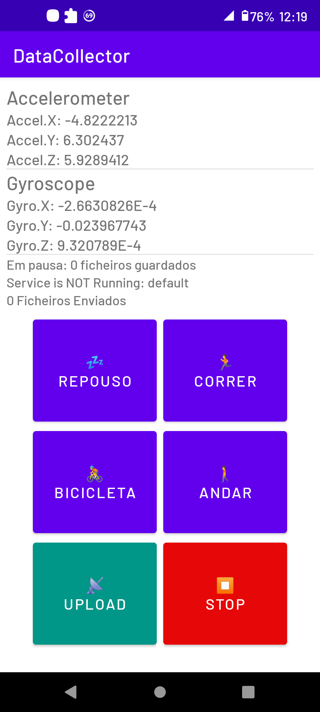
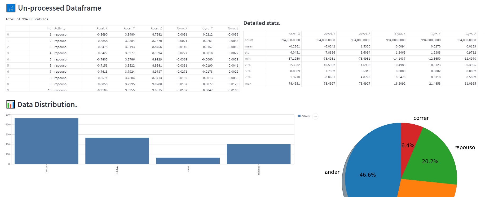
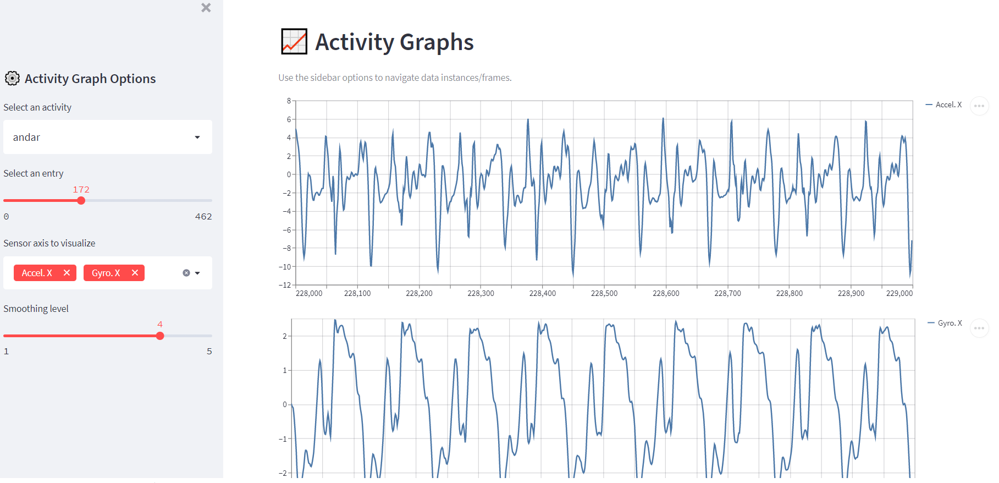

# Physical Activity Recognition
> Group lab project developed by me, [@joao40sa](https://github.com/joao40sa) and [@DiogoLima24](https://github.com/DiogoLima24)

Deep learning model in Tensorflow capable of classifying/recognizing a person's activity using their smartphone's gyroscope and accelerometer data.

As of now, the DL model is trained to be able to recognize whether a user was:
1. Running
2. Walking
3. Riding Bicycle
4. Resting
---
## Data Collection

The data for this project was collected using an Android app (developed as a lab group project) that would store the phone's Accelerometer and Gyroscope information. 

Activity data is sent to a Firebase storage server and can be later downloaded for training and testing purposes.

**Android App**
<p align="left">
    
</p>


**Data structure:**
- Acclerometer:
  - Acceleration on the X axis (meters per second)
  - Acceleration on the Y axis (m/s)
  - Acceleration on the Z axis (m/s)
- Gyroscope:
  - Rotation around the X axis
  - Rotation around the Y axis
  - Rotation around the Z axis

---
## Data Visualization
Data is visualized with a custom web app specifically made for this project using [Streamlit](https://streamlit.io/).

To run the visualization app, enter the command: ```streamlit run data_viz.py``` inside the `data` directory. This will start a local server with the web app.

It can display essential data stats:
<p align="center">
    
</p>

It's also very useful if one wants to explore and analyze the collected instances of data individually. 

This means we can inspect the particularities in the patterns pertaining to the supported physical activities:
<p align="center">
    
</p>

---
## Deep Learning Model
The final implementation of the DL model is a simple DNN. Previous versions utilized a CNN architecture, but predictions results were inferior and the DNN version also has better performance while being less complex (which is promising for a future mobile implementation).

The model's full implementation is done in Tensorflow and can be found inside the `model` directory. There are also two Jupyter notebooks for experimentation.

